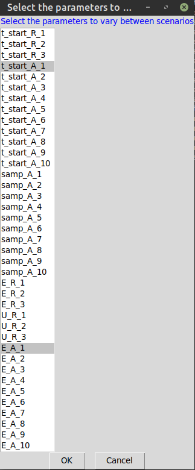

```{r, include = FALSE}
knitr::opts_chunk$set(
  collapse = TRUE,
  comment = "#>"
)
```

## Step 0: Installing the Package

`PVAInvadR` is available from a public GitHub repository.
To install it, you need to install and use the `devtools` package.

If not yet installed, first install the `devtools` package.

```{r install_devtools, eval = FALSE}
install.packages("devtools")
```

Once installed, load the library so you can access its functions, then install and load the `PVAInvadR` package from GitHub.

```{r lib_devtools, eval = FALSE}
library(devtools)
devtools::install_github("mairindeith/PVAInvadR")
library(PVAInvadR)
```

## Step 1: Define PVA parameters

**P**opulation **V**iability **A**nalysis (PVA) requires two types of parameters.

1. **Biological parameters** that describe the species impacted by controls, and
2. **Control parameters** that describe the controls (e.g. fishing gear types) and their impact on the target species.

The first step is to define the biological and control parameters to be used in PVA simulations.
The easiest way to do this is to download and fill in the template .csv, using the `pva_template` function.
This function downloads a blank parameter template - fill this in with the biological and control parameters.

Replace `PATH/TO/TEMPLATE` with the full file path and file name where you would like to save the template.

```{r pva_template, eval = F}
pva_template("PATH/TO/TEMPLATE.csv")
```

Now you can edit the template and define your PVA parameters.

Open up the .csv, here are the first few rows.

```{r echo=F}
library(knitr)
param_names <- c(
    'species',
    'A',
    'AR',
    'nS',
    'nT',
    'dt',
    'n_sim',
    'n_gear',
    't_start_R', #
    't_start_A', #
    # Population parameters
    'V0',
    'reck',
    'p_can',
    'K',
    'afec',
    'Wmat',
    't_spn',
    'Ms',
    'Bs',
    'V1',
    'bet',
    'cann_a',
    'sd_S',
    'UR', #
    'UA', #
    'samp_A',
    'E_R', #
    'E_A', #
    'C_f_R', #
    'C_f_A', #
    'C_E_R', #
    'C_E_A', #
    'r',
    'G',
    'v_a', #
    'v_b', #
    'v_c', #
    'v_d', #
    'init_NA'
  )
  notes <<- c(
    'Species abbreviation',
    'Maximum age (only 1% of fish survive when unfished)',
    'Age at recruitment (years)',
    'Number of pre-recruit stanzas',
    'Length of simulation (number of years)',
    'Time-step length as a proportion of one year (<1 means more than 1 time step per year)',
    'Number of simulations',
    'Number of gears applied to recruited animals',
    'Time-step when removal starts for each pre-recruit stanza (separate stanza-specific parameters with ";")',
    'Time-step when removal starts for each gear used on recruited animals (separate gear-specific parameters with ";")',
    'Range of unfished recruited abundance (separate lower and upper range with ";")',
    'Recruitment compensation ratio (difference in juvenile survival between unfished and near-zero density)',
    'Proportion of mortality at equilibrium that is due to cannibalism',
    'von Bertalanffy growth parameter',
    'Fecundity multiplier on weight',
    'Minimum weight at maturity (as a proportion of maximum weight)',
    'Time-steps of the year when spawning occurs (inclusive of the upper time step; i.e. a range of 1-2 indicates that spawning occurs in the first and second time steps)',
    'Maximum survival by stanza (separate stanza-specific parameters with ";")',
    'Stanza-specific maximum available habitat (separate stanza-specific parameters with ";")',
    'Initial number of vulnerable fish in the population',
    'Hyperstability parameter',
    'Age at which cannibalism begins',
    'Standard deviation in recruitment across years',
    'Proportion of pre-recruit animals removed by gear (proportion caught per unit effort; separate stanza-specific parameters with ";")',
    'Proportion of recruited animals removed by gear (proportion caught per unit effort; separate gear-specific parameters with ";")',
    'Time step(s) in the year that each gear is fished (enter "1" if there is only 1 time step per year; separate gear-specific parameters with ";")',
    'Effort expended by each pre-recruit capture gear (separate gear-specific parameters with ";")',
    'Effort expended by each recruit capture gear (separate gear-specific parameters with ";")',
    'Fixed cost associated with each pre-recruit capture gear (separate stanza-specific parameters with ";")',
    'Fixed cost associated with each recruit capture gear (separate gear-specific parameters with ";")',
    'Effort-based cost associated with each pre-recruit capture gear (separate stanza-specific parameters with ";")',
    'Effort-based cost associated with each recruit capture gear (separate gear-specific parameters with ";")',
    'Discount rate (optional)',
    'Generation time (optional)',
    #'Proportional to ascending slope of dome-shaped selectivity curve',
    #'Proportional to length at maximum selectivity',
    #'Rate of decline of dome-shaped selectivity (bounded between 0-1)',
    'Logistic ascending slope of removal gear for recruited animals (as a proportion of Linf)',
    'Ascending length at 50% selectivity of removal gear for recruited animals (as a proportion of Linf)',
    'Logistic descending slope of removal gear for recruited animals (as a proportion of Linf)',
    'Descending length at 50% selectivity of removal gear for recruited animals (as a proportion of Linf)',
    'Initial age structure in the population (default is NA; separate age-specific population sizes with ";")'
  )

  file_out <- data.frame(
    Parameters = param_names,
    # values = "",
    Description = notes
  )
kable(head(file_out), align='l')
```

The template includes names of parameters needed by `PVAInvadR`, a blank column to be filled with parameter values, and a brief description of the parameter's meaning.
Multi-value parameters (e.g. parameter ranges, or parameters specific to different stanzas/control gears) should have each value separated by a `;`.
These parameters should be provided in stanza/gear order.

Other parameters are input as ranges of values.
These should be defined using the same format: `lower range; upper range`.

Any parameters that expect `;`-separated parameter values will indicate this in the parameter's description.

After filling in the csv, load it in to the R session using `load_pva_parameters`. Replace `PATH/TO/FILLED_TEMPLATE.csv` with the path to your now filled-in .csv template.

```{r loadparams, eval = F}
params <- load_pva_parameters("PATH/TO/FILLED_TEMPLATE.csv")
```

## Step 2: Running your first `PVA`

For the rest of the quick start guide, we're going to use `PVAInvadR`'s built-in dataset as an example.

Load the example dataset and save these parameters with the variable name `params`.

```{r secretPackageLoad, echo = F}
library(PVAInvadR)
```

```{r dataload}
data("fusee")
params <- fusee
```

Using these input parameters, let's run a PVA and save the results to `pva_results`.
Let's also include a plot of simulated abundance over time by setting `create_plot = TRUE`. For the sake of this vignette, we are going to run the command with `quiet = TRUE`, but you can remove this to see output information, like the progress of the PVA simulations and plotting.

```{r firstpva}
pva_results <- PVA(params, create_plot = TRUE, quiet = TRUE)
```

`PVA` returns a number of objects in the form of a named list,
including input parameters, parameters calculated from these inputs, and the results of the PVA.

These outputs include parameters derived from input parameters, annual and total cost estimates, population status, probability of extirpation over time and simulation time.
When `create_plot` is called, you can also see a population trajectory plot.
Warmer regions represent those more frequently arising across PVA iterations.

```{r pvaresults}
names(pva_results)
pva_results$plot
```

## Step 3: Comparing multiple control scenarios with `decision`

Multiple control scenarios - defined as a unique combination of gears and applications of gears -
can be compared with `decision`.

First, name your scenarios and save as a vector.

```{r defscenarios}
scenarios <- c("Scenario A", "Scenario B")
```

Next, we set up scenario templates to fill in.
But before the template can be created we need to define which parameters will vary across these scenarios.
You can select which parameters you would like to vary between scenarios by either:

1. Using a pop-up window and clicking on each parameter you want to modify, or
2. Creating a vector of the names of control parameters (and the stanzas/gears they relate to where applicable)

For this vignette, we will use option 1, the pop-up window.

In this example, we will only modify a single parameter per scenario.
_ScenarioA_ will increase the effort exerted by gear 1 on adults (parameter `E_A_1`) from 0 to 2.
_ScenarioB_ will also increase the effort to 10, and will also sample gear 1 at an earlier timestep in the year (parameter `t_start_A_1`) from 15 to 10.

Run `decision_setup`, select the parameters `E_A_1` and `t_start_A_1` to create a template .csv saved at `PATH/TO/DECISION_TEMPLATE.csv`.

```{r decsetup_csv, eval = F}
decision_setup(params, scen_names = scenarios, csv = TRUE, csv_path = "PATH/TO/DECISION_TEMPLATE.csv")
```

Select the modified parameters in the pop-up window.



Now, modify the .csv with each scenario's modified set of control parameters.
The .csv created by `decision_setup` pre-sets each parameter to its current value in the original input dataset, so any value you do not have to modify can be left with its default value.


The `decision` function will now simulate the defined scenarios and output a decision-support table with summary comparisons of scenarios.

Now, all you need to do is run the `decision` function.
`decision` requires the original parameter inputs, `params`, and the path to the scenario csv you just filled in (`decision_csv`, replace `PATH/TO/DECISION_TEMPLATE.csv` below to the file with your scenario-specific control parameters).
You can also run the function in parallel by specifying `parallel = TRUE`.

As `decision` runs, it will print which Scenario it is running and what control parameter values were supplied for this scenario.

```{r decision, eval = F}
dec <- decision(params,
  decision_csv = "PATH/TO/DECISION_TEMPLATE.csv",
  parallel = TRUE) # Turn off for a manipulatable data frame format
```

```{r decision_real, echo = F}
dec <- decision(params, decision_csv = "dec_template.csv", parallel = TRUE, pretty = TRUE) # Turn off for a manipulatable data frame format
```

`decision` returns a summary data frame with multiple utility values: annual and total cost, probability of eradication, expected time for eradication, and median abundance across PVA simulations of each scenario.

```{r decision_out, echo = F}
dec # Turn off for a manipulatable data frame format
```


### These perform the same, change to a better parameter combo.


## Step 4: Explore the consequences of biological parameter uncertainty

The final step in the PVA workflow is to identify how the ranking of scenarios depends on biological parameters.
The `rank_uncertainty()` function repeats the PVA after increasing and decreasing each biological parameters by a set percentage.
Each biological parameter is varied one at a time (so the combined outcomes of multiple parameter uncertainty is not explored here).

`rank_uncertainty` requires only the base parameter inputs, `params`, the .csv of control parameters modified by scenario, and what percent the biological parameters should be varied (but the default value is 15%, resulting in 85% and 115% the original value being evaluated).

Then, the function will output decision ranking criteria when each

Like above, let's run `rank_uncertainty` in parallel, using the `DECISION_TEMPLATE.csv` created earlier.
Normally this function prints information regarding PVA simulations and intermediate results as it runs.
For now, let's turn this printing off by specifying `quiet = T`.

`rank_uncertainty` may take up to a few minutes to run, depending on your computer's hardware (especially number of cores available to compare scenarios in parallel.

```{r rankuncertainty_dummy, eval = F}
ru <- rank_uncertainty(params, decision_csv = "PATH/TO/DECISION_TEMPLATE.csv", parallel = TRUE, quiet = TRUE)
```

```{r rankuncertainty_real, echo = F}
ru <- rank_uncertainty(params, decision_csv = "dec_template.csv", parallel = TRUE)
```

The output of `rank_uncertainty` is a named list with two entries: `sensitivity_plots` and `sensitivity_data`.

Both `sensitivity_plots` and `sensivity_data` contain 6 objects (plot objects also have the `_plot` suffix in their names).

- `cost_rankdiff` - using total cost as a performance measure, compare scenarios' **change in rank** after increasing or decreasing each biological parameter by some percent
- `cost_absolutediff` - like above, but reporting **absolute difference in cost** instead of change of rank
- `nT_rankdiff` - like above, but report change in rank using population size of the invasive species as the performance measure
- `nT_absolutediff` - like above, but report **absolute change in population size** instead of change of rank
- `pExtirpation_rankdiff` - like above, but report probability of extinction of the invasive population as the performance measure
- `pExtirpation_absolutediff` - like above, but report **absolute change in extirpation probability** instead of change of rank

Data in these objects compare how each scenario performs compared to the default biological parameters (i.e. a rank difference of 1 indicates that the scenario ranks 1 higher than it did under the default conditions; an absolute difference of -12 indicates that the performance indicator is 12 units lower than the default case).

For example, here's the absolute difference in population size:
  
```{r rankuncertainty_outdata}
ru$sensitivity_data$nT_absolutediff
```

Plots summarize the data in the `_data` object using a lollipop plot.
Here's the same data in plot form.

```{r rankuncertainty_outplot}
ru$sensitivity_plots$nT_absolutediff_plot
```

If the scenario ranking doesn't change after sensitivity testing, all differences = 0. For example, there is no change in rank when considering cost after modifying biological parameters. 

```{r rankuncertainty_outplotzero}
ru$sensitivity_plot$cost_rankdiff_plot
```

For more details on `PVAInvadR` and how the model works internally, see [the Comprehensive User Guide vignette](comprehensive-user-guide.html).
